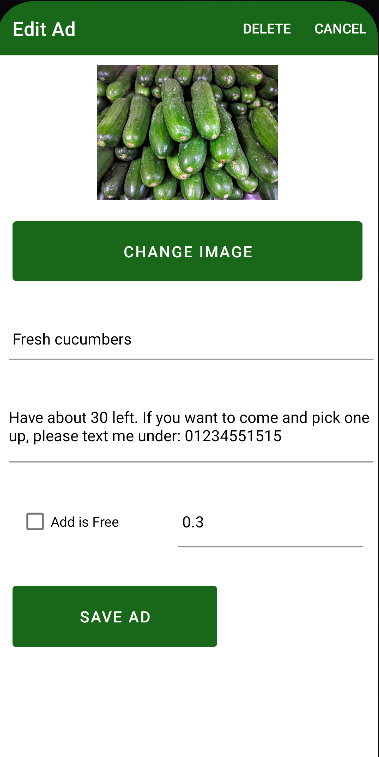
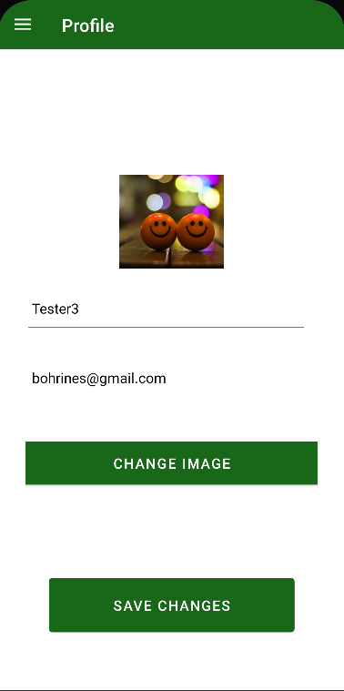

<h1 align="center">Welcome to the GreenCommunity 🌱</h1>
GreenCommunity is an app that is developed using Kotlin and Android Studio. It is an assignment for the KAPK module at the OTH Regensburg.

The purpose of this app is, to create small communities that can share their homegrown produce (e.g that has been grown in a garden) with their neighborhood.

Users can sign-up for the app by using an email and a passwort (basic input). The Authentification process is done by using Firebase Authentification. This means all the user accounts
will be saved in a Firebase Authentification database. 

Users also have the chance to add additional information to their account. This includes adding a username and a profile picture. This data is also saved in the same database as the other creditentials for the account.

After a successful sign-up the user will be automatically signed-in and can start using the application.

One of the Features includes creating ads and posting them. An ad can include a photo, a title, a description and a price (or is FREE). This data is stored on a Realtime Database from Firebase. Each post also saves the User UID (= the User ID from the Authentification Database) from the currently signed-in user, in order to be able to know which ad was created by whom. In addition to that, the location from the device will also be saved. This is important to later only display the ads in a 5km range.

To get the location from the device, the Google API is used. This location gets automatically saved to a new ad when it is created. When the app is used for the first time, the user will get asked for permission to give the location services to the app. If the location services have not been turned on in the device, then the user will be redirected to the location settings.

## Key topics
The following topics will be covered in the following part:
* Installation

* How to use the app
  * Sign up
  * Login
  * Exploring ads
  * Posting ads
  * Edit ads

* UI
    * Brief overview of the Activities with their corresponding layout
        * HomeActivity
        * LoginOrSignUpActivity
        * LoginActivity
        * SignUpActivity
        * AdListActivity  
        * AdActivity
          * No Parcel
          * ad_view Parcel
          * ad_edit Parcel
        * UserAdsActivity
        * ProfileActivity
    * Navigating between Activites

* Firebase
    * Realtime Database Structure
    * Code
    
* Messanger
  
* Tests

* References

## Installation
For the app a minimum SDK of 30 is set. The target SDK is set to 32. This means Android phones running Android 29 and lower won't be able to open this app. 

For the testing purposes of the application an Emulator in Android Studio was used. This was a Pixel 4 running Android 31.

During the course of developing this app other Emulators running Android 30 and Android 32 were also tested, both were Pixel devices again.

## How to use the app
After starting the application, the user will be promted with the HomeActivity. The user can press the button in the middle of the screen. If no user is logged in, then this Activity will redirect the user to another Activity where they can decide wheather they want to login (Account already exits) or want to sign-up for this app.

### Signing up
The sign-up process involves entering data, that will be stored in a Firebase Authentification database. 

<ins>This includes:<ins>
- Username*
- E-Mail*
- Password*
- Profile picture (-> if none uploaded, then default picture will be used)

The ones marked with * are necessary to successfully sign up.

### Login
If the user already has an account, the he can simply login using the E-Mail and passord.

Either way the user will get redirected to the HomeActivity again after a successful login or sign-up.

### Exploring ads
One of the main features that the user can use is to look for ads in their area. The user just has to press the "Explore ads in your area" on the HomeActivity to start looking for ads that are in a 5km radius to their current location.

### Posting ads
Another major feature of this ad, is posting ads. Logged-in users can create new ads, by pressing the plus icon on the top-right in the AdListActivity. 

To create a new ad the user has to provide a bit of information.

<ins>This includes:<ins>
- Title*
- Description*
- Picture (-> if none uploaded, the default picture will be used)
- Price*
- Free (CheckBox)*

The ones marked with * are necessary to successfully post an ad. Keep in mind, that the price and free checkbox don't have to be both clicked or supplied. Only one of them is necessary. For example, if the free checkbox is checked, the price will be automatically set to 0.0€. And if a price is entered, the free checkbox won't be clickable anymore.

### Edit ads
Users can edit their already posted ads. First they need to navigate to in the Navigation Drawer to the "Your ads" option, to see a list of their ads. By clicking on one of these ads, another activity is started where changes can be made and saved.

All the data can be changed.

<ins>This includes:<ins>
- Title
- Description
- Picture (-> if none uploaded, the default picture will be used)
- Price
- Free (CheckBox)

Ads can also be deleted here, by clicking the delete button on the top-right of this activity.

### Message another user
When a user has clicked on a ad in their area, they have the option to message the owner of this ad.

## UI
In this section, a brief overview of all the activties can be found with a major focus of their design.

### HomeActivity
This is the current design of the HomeActivity:


The Homeactivity consist of one major functionality. This is the "Explore ads in your area" in the middle of the screen. This button redirects the user to the AdListActivity, if a user is logged-in, or to the LoginOrSignUpActivity, if no user is logged-in yet.

In the HomeActivity the user can also use the Navigation Drawer on the top-left. The Navigation Drawer will be further explained in a another chapter.

### LoginOrSignUpActivity

This is the current desing of the LoginOrSignUpActivity:


In this the activity, the user is notified of not being signed-in and then gets presented with two buttons. One to sign-up and one to login. This depends on what the user needs. For example, if an user already has an account, then the login button should be used. This will redirect the user to the LoginActivity. If the user doesn't have an account yet, then they should use the sign-up button. This will redirect them to the SignUpActivity.

Bot of those activities will be further explained in the following.

### LoginActivity

This is the current design of the LoginActivity:


In the LoginActivity only two EditText components are displayed. One for the E-Mail and one for the password. If the creditentials match with the Firebase Authentification Databse the user will be logged-in, a Toast message will be shown to display the success and the user gets redirected to the HomeActivity.

If the users credidentials don't match the user will **not** be logged in and a Toast message will display this error. The user will not be redirected. Therefore, they can try to login again, using the same activity.

### SignUpActivity

This is the current design of the SignUpActivity:


In the SignUpActivity are various components displayed. First there are three EditTexts, which can be used by the user to input their data. These three include the username, the e-mail and the password.

In addition to that, the user can add an image to their profile. This can be done by pressing the add image button. When this button is pressed the user will be redirected to their photos and can selected an image that they would like to upload. 

If they choose to not upload an image, then a default image, which can also be seen on the screenshot, will be used instead.

After entering the needed information, the user can press the sign-up button at the bottom to create an account. The information provided by the user gets stored in the Firebase Authentification Database.

After the successful sign-up the user gets redirected to the HomeActivity and is logged-in with their just created account.

If the sign-up was not successful, information in form of Toast messages are displayed. For example, a Error message will be displayed, if the user doesn't enter a title.

### AdListActivity

This is the current design of the AdListActivity:


The AdListActivity displays all the ads that are in a 5km radius of the current Location of the device. The RecyclerView shows the ads in a CardView. Each ad is displayed with an image (if one was uploaded), the title of the ad (in bold) and the price, if the ad is not free. If the ad was has the Checkbox isFree checked, then the Card will have a FREE text.

From here the user can select any of the ads that are displayed to open the AdActivity (with the parcel ad_view). This activity will be in the next chapter. 

Furthermore, the user can also create new ads by pressing the + icon in the top-right corner. This also redirects the user to the AdActivity with no parcel.

### AdActivity

<ins>Parcls that exist:<ins>
- ad_view
- ad_edit

#### No Parcel

This is the current design of the AdActivity, if no Parcel is sent:


If no parcel has been sent, then a new ad is being created.

<ins>A new ad can contain the following information:<ins>
- image
- title*
- description
- isFree* (CheckBox)
- Price*

The ones marked with * are needed in order to be able to post the ad.

When the user presses the add image button, they will be redirected to their photos on their device. This is done by using an ImagePicker.

When the Checkbox isFree is checked, the price will automatically be set to 0.0 and the EditText will not be clickable anymore.

If the CheckBox is not checked, but the user still enters a price of 0, then the Checkbox will be automatically checked, when the ad is posted.

#### ad_view Parcel

This is the current design of the AdActivity, if the ad_view Parcel is being send:


The ad_view Parcel is being sent from the AdListActivity, when an ad is clicked on the RecyclerView. This parcel makes sure, that the user can only view the ad and not edit it.

#### ad_edit Parcel

This is the current design of the AdActivity, if the ad_view Parcel is being send:




The ad_edit Parcel is being sent from the UserAdsActivity (this activity will be explained in the following chapter), when an ad is clicked on the RecyclerView. This parcel makes sure, that the user, that has created this ad, is able to make changes.

In addition that, the user can also decide to delete this ad. This can be achieved by clicking in the delete button on the top-right. This then removes the saved data under this key from the Firebase Realtime Database.

### UserAdsActivity

This is the current design of the UserAdsActivity:


This activity only display ads that have been created by the currently logged-in user. This is done by saving the userID (from the Firebase Authentification Databse) with each ad in the Firebase Realtime Database.

To correctly fill the RecyclerView, the list that is handed over to the Adapter is changed accordingly. It takes the current snapshot from the Realtime Database and if the userID of the stored ad does not match the current user's userID, then this ad is not added to the list.

### ProfileActivity

This is the current design of the ProfileActivity:



The ProfileActivity displays the currently logged-in user's information that has been saved with the creation of the account. The user can also make changes to their account here. 

<ins>Possible changes:<ins>
- Profile Picture
- Username

So far only those two aspects can be changed. The changes are then adjusted in the Firebase Authentification Database as well.

In the future it would make sense to add the feature to change the creditentials (email, password) as well.

### Navigating between Activites

For navigation purposes a Navigation Drawer is implemented. 

<ins>Visible on the following activities:<ins>
- HomeActivity
- AdListActivity
- UserAdsActivity
- ProfileActivity

This is the current design of the Navigation Drawer:


The NavDrawer can be opened through swiping from left to right on the screen or by clicking the Burger symbol on the top-left.

<ins>The NavDrawer includes the following items:<ins>
- Home -> HomeActivity
- Profile -> ProfileActivity
- Your Ads -> UserAdsActivity
- Account settings
  - Login -> LoginActivity
  - Logout -> HomeActivity (user gets signed-out)
  - Sign-Up -> SignUpActivity

If the user is for example alreay on the HomeActivity but selects the Home item, nothing will happen. This is done for each activity in the same manner.

## Firebase

For the storage of data in every aspect Firebase was used. As mentioned throught this file, currently two databases are used. The Authentification DB and the Realtime DB.

The Authentification DB stores all the active accounts. They can also be manually deleted again from the system, but only by using the Firebase console.

The Realtime DB stores all the ads that have been posted to the system. 

### Realtime Database structure

This shows an example of how the DB is strucutred. The key for each post is a randomly generated key by Firebase. This key is then also saved in the ad itself, to later used it to find the post for a specific ad.


### Code

In this section only a small amount of the actual code is displayed. But it will give a small overview of what was used in the development of this app.

It will focus on the code that uses the Firebase API.

To add the Firebase to the project, the following guide was used:
https://firebase.google.com/docs/android/setup

#### Authentification

<ins>Initialization<ins>

Following variable is needed:

```kotlin
private lateinit var auth: FirebaseAuth
```

```kotlin
auth = FirebaseAuth.getInstance()
```

<ins>Sign-Up Process:<ins>
```kotlin
auth.createUserWithEmailAndPassword(binding.email.text.toString(), binding.password.text.toString()).addOnCompleteListener(this, OnCompleteListener { task ->
                        if(task.isSuccessful){
                            if(img != null){
                                addUserImgAndUsername(img)
                            }else{
                                addUsername()
                            }
                            Toast.makeText(this, "Successfully Registered", Toast.LENGTH_LONG).show()
                            val intent = Intent(this@SignUpActivity, HomeActivity::class.java)
                            startActivity(intent)
                            finish()
                        }else {
                            emailAlreadyUsed()
                        }
                    })
```
The createUserWithEMailAndPassword method creates a new user in the Authentification DB. Since I used this way of authentification, the  profile picutre and username are normally not added to the account. They have to be added manually. 

This is done by the two methods:
- addUserImgAndUsername(image : URI)
- addUsername

both of these methods call the updateProfile method that adjust the user account again.

Example: addUsername()

```kotlin
private fun addUsername(){
        if(auth.currentUser != null){
            val profileUpdates = userProfileChangeRequest {
                displayName = binding.username.text.toString()
            }

            auth.currentUser!!.updateProfile(profileUpdates)
                .addOnCompleteListener { task ->
                    if(task.isSuccessful) {
                        i("Username has been updated")
                    }
                }
        }
    }
```

<ins>Login Process<ins>

```kotlin
auth.signInWithEmailAndPassword(binding.email.text.toString(), binding.password.text.toString()).addOnCompleteListener(this, OnCompleteListener { task ->
                    if(task.isSuccessful){
                        Toast.makeText(this, "Successfully Logged In", Toast.LENGTH_LONG).show()
                        val intent = Intent(this@LoginActivity, HomeActivity::class.java)
                        startActivity(intent)
                        finish()
                    }else{
                        binding.errorText.text = "Email or password incorrect"
                        binding.errorText.visibility = View.VISIBLE
                    }
                })
```

The login is done by using the signInWithEmailAndPassword method. This compares the ceditentials that have been entered with the Authentification DB. If a user is found, that matches the information, then they will be logged-in. Otherwise an error text will be displayed.

<ins>Logout Process<ins>

```kotlin
auth.signOut()
```

To logout the current user, the signOut method has to be called on FirebaseAuth object.

#### Pushing ads

For the method below I used the following guide:
https://www.kodeco.com/books/saving-data-on-android/v1.0/chapters/13-reading-to-writing-from-realtime-database

```kotlin
private fun writeNewAd(){
        key = database.push().key ?: ""
        ad.id = key
        var newAd = AdModel(ad.id, ad.title, ad.description, ad.price, ad.longitude, ad.latitude, ad.isFree, ad.adImg,
                    auth.currentUser?.uid)

        database.child(key)
            .setValue(newAd)
    }
```

First of all this methos gets a push key from Firebase. This is important since the ad needs to store this information as well. Therefore, the ad.id. is set to the just generated key.

The whole ad then gets pushed to the Realtime DB under the key that has been created in the beginning.

#### Updating ads

```kotlin
private fun updateAd(){
        val updatedAd = AdModel(ad.id, ad.title, ad.description, ad.price, ad.longitude, ad.latitude, ad.isFree, ad.adImg,
                        auth.currentUser?.uid)

        key = ad.id.toString()
       
        database.child(key).setValue(updatedAd)
    }
```

To update an ad, the push key is needed again. Through this key, which is stored in the ad.id the ad can be found.

Currently, the updateAd method overrides the whole ad again.

#### Deleting ads

```kotlin
private fun deleteAd() {
        key = ad.id.toString()
        database.child(key).removeValue()
}   
```
To delete an ad, the push key is needed once again. Through this key, the selected ad can be found in the Realtime DB and then removed through the removeValue method.

## Messanger

As of right now, no messanger has been implemented. But it is planned to do so using Firebase once again.
The following guide will be used for this:
https://firebase.google.com/codelabs/firebase-android#0

## Tests

As of right now, no tests have been implemented. But is planned to do so using the following guide:
https://developer.android.com/training/testing/fundamentals

## References

All references of guides or stackOverflow posts can be found in the Code documentation of this project.

## Author

[](https://github.com/boini12)

